# Assembly

This is just an illustrated guide on how to best pack the electronics in the 3D printed case.

1. Screw the LoRa32 module in its frame using 2mm screws.

  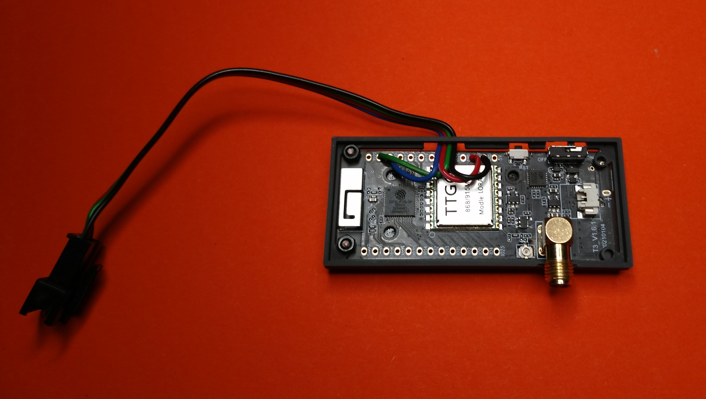
  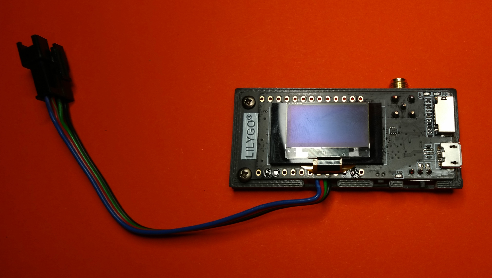

2. Screw the Banana Pi Zero into its frame using 2.5mm screws.

  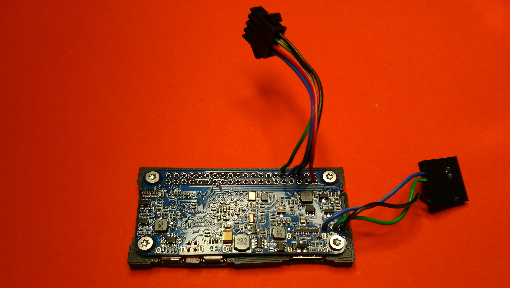
  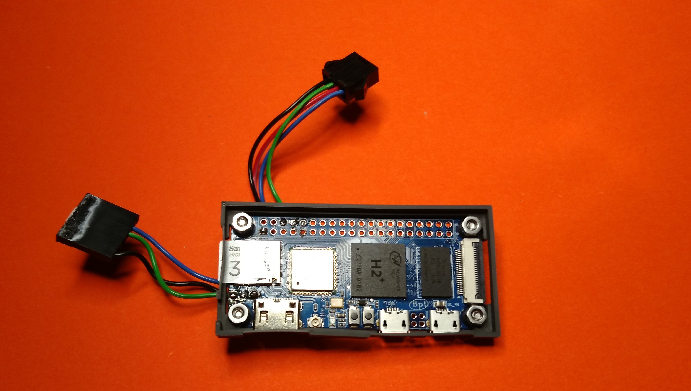

3. Screw the Antenna Cable into the top part of the case.

  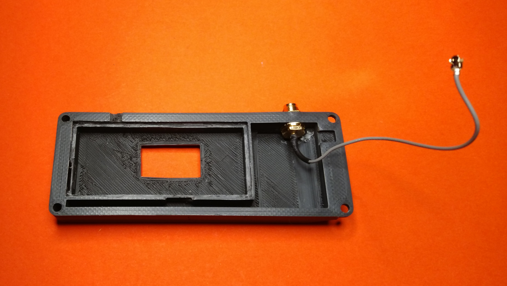

4. Put the LoRa32 into the top case, make sure to run the cables as shown in the picture.

  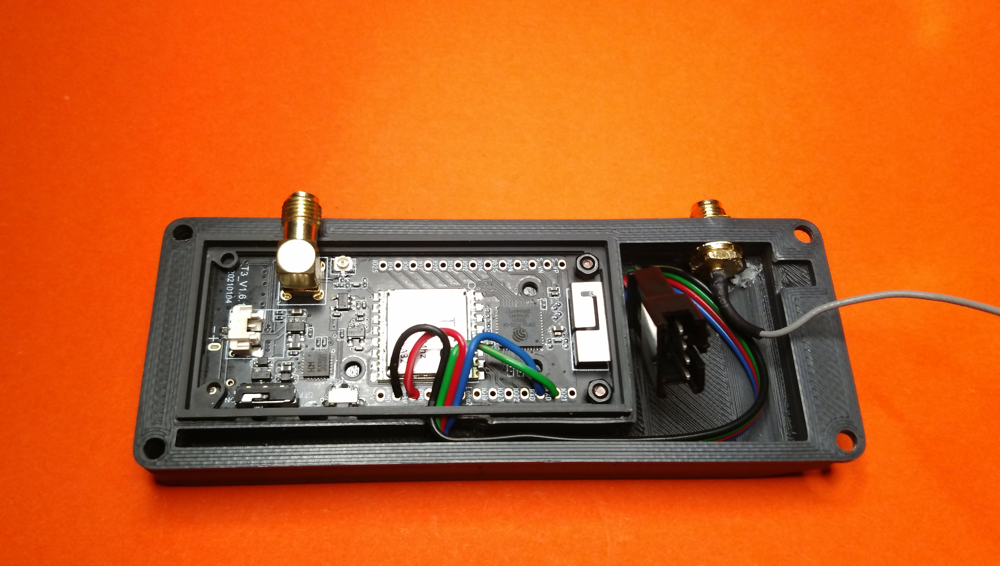

5. Add the middle part of the case.

  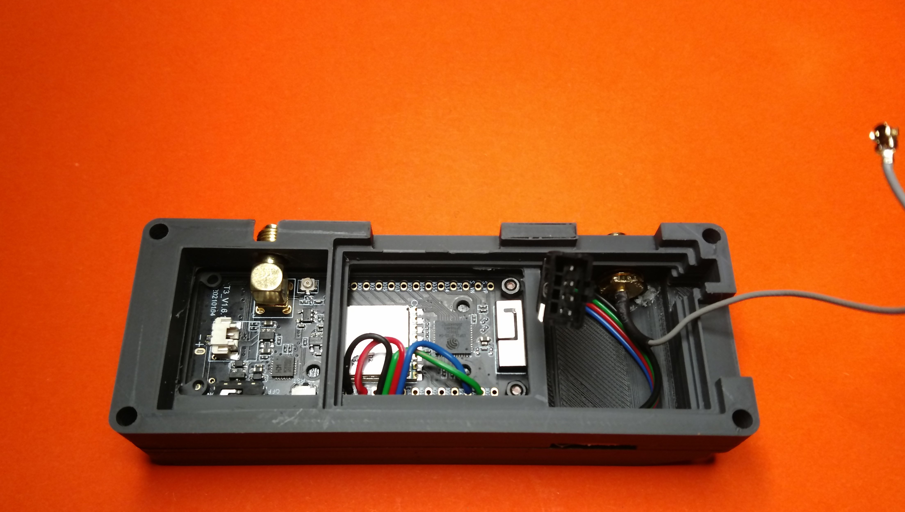

6. Connect the Banana Pi Zero to the LoRa32 module and place the JST-SM connector in the case as shown in the picture.

  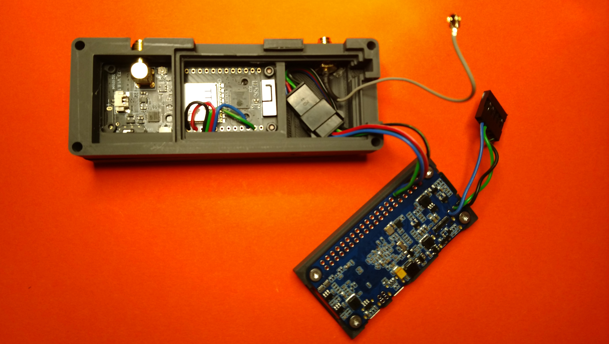

7. Put the Dupont debug connector in the slot between top and middle case parts (It should be held in place once screws are tightened).

  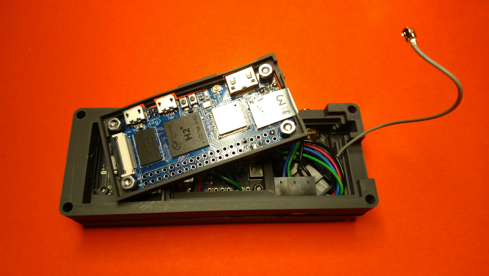

8. Place the Banana Pi Zero in the middle case part. Lead the antenna cable through the gap and plug it into the Banana Pi Zero

  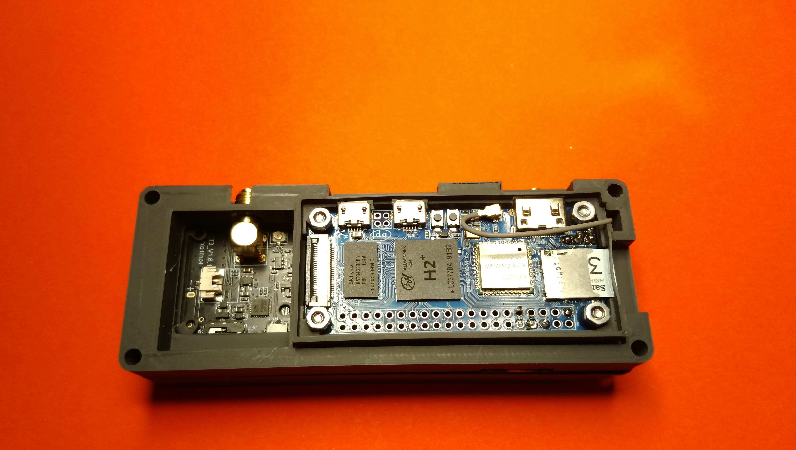

9. Put the bottom case part on top and use 3mm screws to tighten it.

  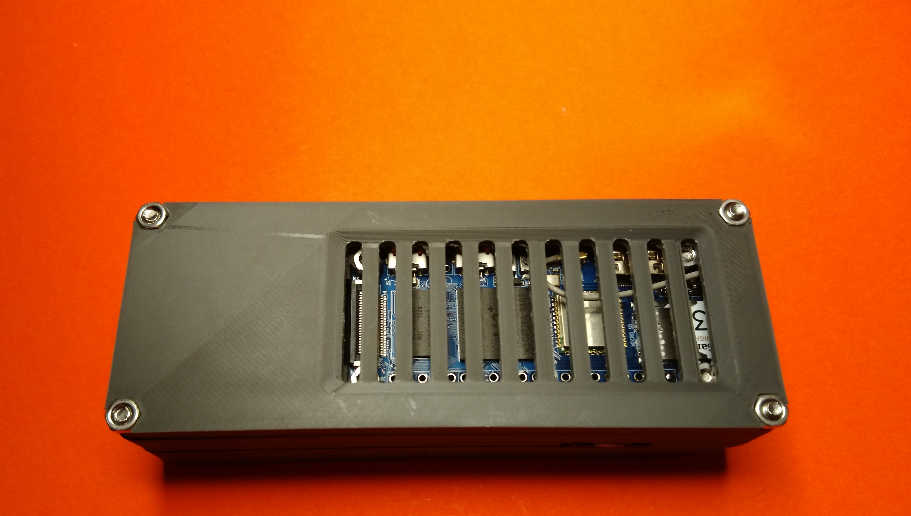

10. Attach the antennas.

  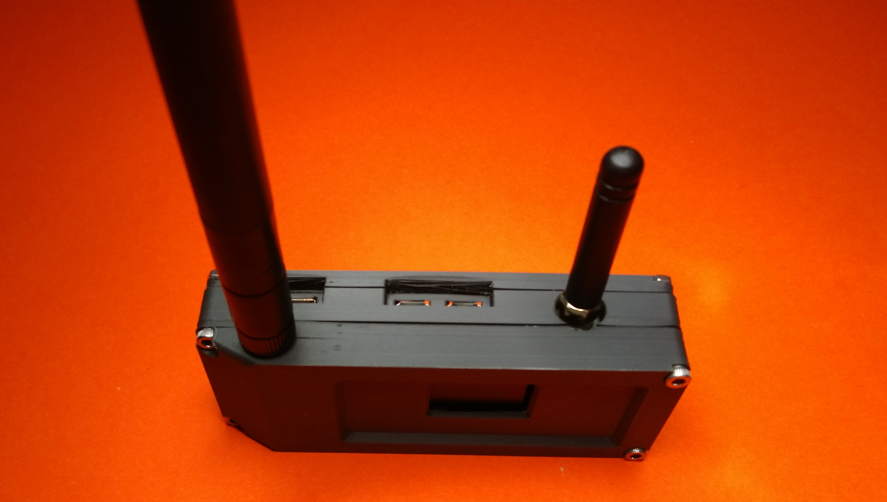

11. One of:
  - Attach an serial<->USB adapter to the debug port and connect it via USB with your PC.
  - Connect a monitor via the HDMI port.

  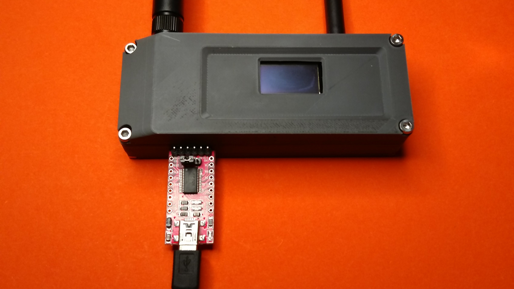

Continue with [Setting up the System](SETUP.md)
