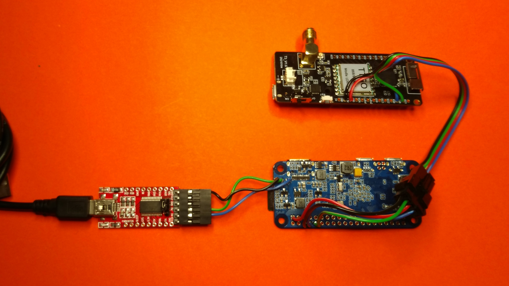

# Build

**Notes**

- TXD/RXD lines have to be crossed for a serial connection. This is achieved by switching the blue and green wire when soldering it into TXD and RXD connection, as seen in the pictures below.
- The TTGO LORA32 board is powered through the 3.3V pins from the Banana Pi Zero M2
- If you plan to use an HDMI monitor instead of a FTDI<->USB adapter, you can skip installing the debug connections (Steps 1 and 5)
- Your FTDI<->USB Adapter might have a different pinout, please make sure you put the pins into the Dupont connector accordingly (RXD/TXD lines crossed!).

1. Solder the 3 cables for the debug connection and 4 cables for the connection with the LORA3 to the Banana Pi Zero M2 

  
  

2. Solder the 4 cables for the connection with the LORA3 to the Banana Pi Zero M2 

  
  

3. Solder the 4 cables for the connection with the Banana Pi Zero M2 to the TTGO LORA32

  
  

4. Join the JST-SM connectors with the 4 cables connecting Banana Pi Zero and TTGO LORA32

  

5. Join the Dupont connector with the three debug cables from the Banana Pi Zero M2

  

6. Banana Pi Zero M2, TTGO LORA32 and a FTDI<->USB adapter connected

  

