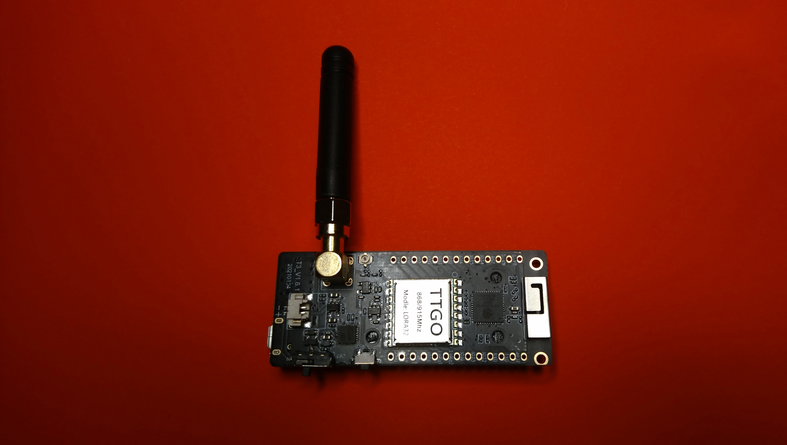

# Required Hardware

## Banana Pi Zero

**Name** Banana Pi M2 Zero 
**URL** https://wiki.banana-pi.org/Banana_Pi_BPI-M2_ZERO 
**Source** https://www.reichelt.de/banana-pi-m2-zero-1-2-ghz-quad-core-512-mb-ddr3-banana-pi-zero-p218297.html 

  

## ESP32 based LoRa module

**Name** LILYGO® TTGO ESP32-Paxcounter LoRa32 V2.1 1.6 
**URL** http://www.lilygo.cn/prod_view.aspx?TypeId=50003&Id=1130&FId=t3:50003:3 
**Source** https://www.ebay.de/itm/164396959192 
**Frequency** 868 Mhz 

  
  

## WIFI Antenna

**Name** 2.4GHz WIFI antenna SMA Female 
**Source** https://www.ebay.de/itm/183989745716 

## SMA - IPEX adapter cable

**Name** RP-SMA(Male) to IPEX/U.FL Pigtail Cable 
**Source** https://www.ebay.de/itm/265495161098 

## Wires

Each approx. 30cm:
- red
- black
- green
- blue

## Connectors

1x Dupont connector female (6 pin) 
1x JST SM connector female (4 pin) 
1x JST SM connector male (4 pin)

## Screws

2x M2 x 5mm
4x M2.5 x 5mm
2x M3 x 18mm
2x M3 x 25mm
